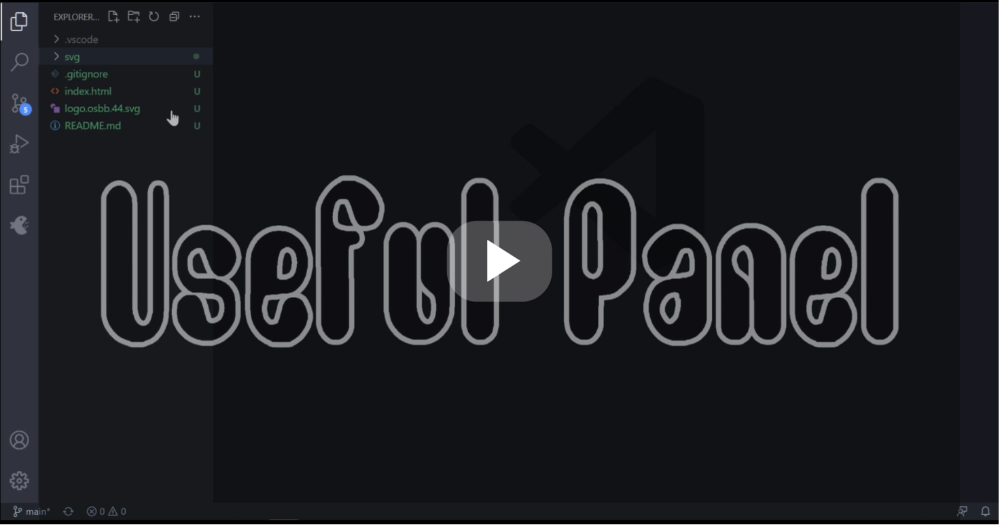

 

 

# [USEFUL PANEL](https://andrey-hilux.github.io/vscode.extension.usefulPanel/) | Ready(98.12%)

Firstly, it was the tool-based emergency system designed around the capability API of a [VS Code IDE](https://code.visualstudio.com).
As maximum and convenient, flexible, super-fast [*Extreme programming* (XP)](docs/extreme-programming_XP.md) platform was aimed at the create more features, methods, and capabilities for emergency cases arising from sudden bugs out of new updates, rules, changes, .etc. Allowing programmers to design temporary or permanent solution in no-time.

<h2 id="attention-this-extension-use-the-weak-or-still-development-documented-background-features-of-nodejs-and-can-cause-additional-unforeseen-and-unpredictable-issues" style="color: #ee475e; line-height: 1.4em; "><span>Attention! This extension uses the weak or still development, documented background features of NodeJS, and can cause additional unforeseen and unpredictable issues.</span></h2>

<h2 id="-if-you-are-not-sure-what-you-do-dont-us-it-and-thus--strictly-recommend-for-only-for-personal--using" style="color: #ee475e; line-height: 1.4em; "><span>! If you are not sure what you do, don't use it and thus strictly recommend it for only personal use! </span></h2>

# Visual Studio Code USEFUL PANEL

Yes, I'm using it for a long time, in spite of their "you can’t use the entire XP framework in many situations", And I'm used to it now. You right, it shouldn’t stop you from using as many of the practices as possible given your context.

<table style="width: 100%; border-style: none; "><tr><td style="width: 140px; text-align: center; "><a href="#"></a></td><td><strong>Visual Studio Code USEFUL PANEL</strong><br />Adds a panel for accessing frequently used files, Internet addresses, programs, commands, snippets. Beefed up by "Webpack Config" like behavior configure module.</td></tr></table>

<p class="no-html"><a href="https://andrey-hilux.github.io/vscode.extension.usefulPanel/#vscode-extension-useful-panel-tutorial-video"></a></p>

<sup id="vscode-extension-useful-panel-tutorial-video"></sup>



> **This is derived work based on [Favorites Panel](https://github.com/sabitovvt/vscode-favorites-panel) by Sabitov Vladimir. Extended with our development kit for specific extreme urgency cases.**

#### The integrated AutoFormat automatically formats a document as you save it and as a result there are no sense for try this !

[](https://prettier.io/playground/ "playground")[)](https://prettier.io/docs/en/options.html "options") 

## Auto-config

It's running only when active "Useful Panel", triggers automatically when its first starts, or for all time when configuration compiles errors. Always triggers automatically on save and it is automatically enabled or can't be disabled.

## Source navigation

The specific links on the panel allow you easily navigate to the line which describes its arguments parameter. Set the {_nav:1}, to generate a default sample when the document will be saved.

## Extension Settings

The extension will initial demo configuration if none in .vscode/.favoritesSideBar.js.

```js
() => {
    const howTo = {
        ...
    }
    "favoritesSideBar": {
        commands ": [ {
        ...
    }
]
}
}
```

List of available [icons](https://code.visualstudio.com/api/references/icons-in-labels#icon-listing "icons")

## Environment

 Sandbox  environment-variables. Includes:

```js
{
    require,
    _, // lodash
    vscode,
    env.name // extension name
    env.workspaceFolder // project root directory
    env.сontext // vscode.ExtensionContext
    env.prettier // integrated AutoFormat configuration
}
// env.prettier.semi = false
// env.prettier["singleQuote"] = true
```

## Default config generate:

*  `$$$masterScript$$$ ` -  **✨bonus✨**  generate master script, outside commands block samples, for general config body of code.
* `{_nav:1}, `  or `{_nav:<whatever>}, ` -  generate navigation default sample.
* `{help:1}, `  or `{help:<whatever>}, `  -  generate generate "HOW TO" commands branch.
* `{end:1}, `  or `{end:<whatever>}, `  -  generate "config" end "about" commands.

## Features (basic)

* Quick access to your favorite files
* Quick access to favorite URLs
* Fast launch of applications
* Quick access to your favorite files
* Quick access to favorite commands
* Setting icons for commands

### Go to Definition for Includes

Easy navigate between your files references via the different !include... tags using 'f12' / 'Go to Definition'.

### Editing code

```json
{
    "label": "lowercase ➜ UPPER CASE",
    "description": "",
    "icon": "debug-step-out",
    "command": "runCommand",
    "arguments": [
        "editor.action.transformToUppercase"
    ]
}
```

### Opening file

#### File in project

Settings for opening file in project

```json
{
    "label": "README",
    "description": "- read me",
    "command": "openFile",
    "arguments": ["README.MD"]
}
```

#### File is out project 

Settings for opening file in project

```json
{
    "label": "Hosts",
    "description": "Windows hosts file",
    "command": "openFile",
    "arguments": ["C:\\Windows\\System32\\drivers\\etc\\hosts", "external"]
}
```

#### Open Search panel

command: `workbench.action.findInFiles`

arguments:

* query?: string; 
-	isRegex?: boolean; 
-	triggerSearch?: boolean; 
-	filesToInclude?: string; 
-	filesToExclude?: string; 
-	isCaseSensitive?: boolean; 

```json
{
  "label": "Find in files",
  "description": "",
  "command": "runCommand",
  "arguments": ["workbench.action.findInFiles", {"query": "SearchPattern", "triggerSearch": true}],
},
```

#### Insert text

Search and insert text by regexp pattern. Searches until the first match.

```json
{
  "label": "Replace",
  "description": "",
  "icon": "find-replace",
  "command": "insertNewCode",
  "arguments": ["ui/components/tableItem.ts", "<td className=\"col-date-time\">", "<div className=\"new\">NewText</div>", "before"],
}
```

#### Replace text

Search and replace text by regexp pattern. Searches until the first match.

```json
{
  "label": "Replace",
  "description": "",
  "icon": "find-replace",
  "command": "insertNewCode",
  "arguments": ["ui/components/tableItem.ts", "<td className=\"col-date-time\">", "<div className=\"WOW\"></div>", "replace"]
}
```

#### Replace All text

Search and replace text by regexp pattern. Searches all match.

```json
{
  "label": "ReplaceAll",
  "description": "",
  "icon": "find-replace",
  "command": "insertNewCode",
  "arguments": ["ui/components/tableItem.ts", "<td className=\"col-date-time\">", "<div className=\"WOW\"></div>", "replaceALL"]
}
```

<sup id="menu-Features--Extended"></sup>

## Features (Extended)

* [Extend (runCommand)](#menu-Features--Extended_runCommand)
* [`toLineConfigNavigate`](#menu-Features--Extended__toLineConfigNavigate) - [string](#menu-Features--Extended_toLineConfigNavigate_string), [line number](#menu-Features--Extended_toLineConfigNavigate_line_number), [RegExp](#menu-Features--Extended_toLineConfigNavigate_RegExp)
* [`setTimeout_worker`](#menu-Features--Extended__setTimeout_worker) - basic `setTimeout` on "in-thread mechanism"  for  "smart" delaying work. 
* [`onSave` ](#menu-Features--Extended__onSave)- inject feature in to onSave handle of [VSCode](https://code.visualstudio.com) core 
* [`jumpTo` ](#menu-Features--Extended__jumpTo)- part of inner navigation system to navigate in your code, moving between commands positions easily and quickly. 

<sup id="menu-Features--Extended_runCommand"></sup>

### Extend (runCommand):

* `cmd` - [basic](#menu-Features--Extended_runCommand-basic), [lines](#menu-Features--Extended_runCommand-lines), [parameter switches](#menu-Features--Extended_runCommand-parameter-switches)
* `node` - [eval](#menu-Features--Extended_runCommand-eval), [script](#menu-Features--Extended_runCommand-script)
* `terminal` - [scripts](#menu-Features--Extended_runCommand-terminal-scripts), [text](#menu-Features--Extended_runCommand-terminal-text), [environment-variables](#menu-Features--Extended_runCommand-terminal-environment-variables)
* `sel` - [mutate selection string](#menu-Features--Extended_runCommand-terminal-mutate-selection-string)

> (runCommand) Samples:

<sup id="menu-Features--Extended_runCommand-basic"></sup>
<a href="#menu-Features--Extended_runCommand">☰</a>
* **basic**

```js
{
    label: "CMD",
    description: "1",
    icon: "play",
    command: "runCommand",
    arguments: [
        "cmd",
        `
"C:\\Program Files (x86)\\Google\\Chrome\\Application\\chrome.exe"
--user-data-dir="D:\\sets\\Chrome\\plnx.acc"
https://observablehq.com/@observablehq/a-taste-of-observable?collection=@observablehq/overview
            `,
    ],
}
```

<sup id="menu-Features--Extended_runCommand-lines"></sup>
<a href="#menu-Features--Extended_runCommand">☰</a>

* **with line arguments**

```js
{
    id: "ID is needed only for [label,description] identify collision issues!",
    label: "CMD",
    description: "2",
    icon: "play",
    command: "runCommand",
    arguments: [
        "cmd",
        '"C:\\Program Files (x86)\\Google\\Chrome\\Application\\chrome.exe"',
        '--user-data-dir="D:\\sets\\Chrome\\plnx.acc"',
        "https://observablehq.com/@observablehq/a-taste-of-observable?collection=@observablehq/overview",
    ],
}
```

<sup id="menu-Features--Extended_runCommand-parameter-switches"></sup>
<a href="#menu-Features--Extended_runCommand">☰</a>

* **with parameter switches** `list silent`

```js
{
    label: "CMD",
    description: "3: list,git ...",
    icon: "github",
    command: "runCommand",
    arguments: [
        "cmd",
        "list silent",
        `
                cd /D "D:\\<your git directory>"

                git config user.email "<your git email>"
                git config user.name "<your git name>"

                git config core.autocrlf true

                git checkout -b main

                git remote rm origin
                git remote add origin https://<your git name>:<your git password>@github.com/<your git name>/<your git repo>.git

                git rm -r --cached <repo force forder for delete> -f

                git add ./

                git commit -m "main ✨ HOW TO commit"
                git push origin main -u -f
`,
    ],
}
```

#### Run NodeJS

<sup id="menu-Features--Extended_runCommand-eval"></sup>
<a href="#menu-Features--Extended_runCommand">☰</a>

* ##### eval

```js
{
    label: "node",
    description: "2: server",

    icon: "beaker",
    command: "runCommand",
    arguments: [
        "node",
        "-e",
        `
                      var http = require('http'),
                         // open = require('open'),
                          server;
                      server = http.createServer(function (req, res) {
                                res.writeHead(200, {'Content-Type': 'text/plain'});
                                res.end('Hello World\\n');
                              });
                      server.listen(1337, '127.0.0.1',function(){
                          // console.log('Launching the browser on http://127.0.0.1:1337!');
                          // open('http://127.0.0.1:1337');
                      });
`,
    ],
}
```

<sup id="menu-Features--Extended_runCommand-script"></sup>
<a href="#menu-Features--Extended_runCommand">☰</a>

* ##### or script

```js
{
    label: "node",
    description: "1: error no module",
    icon: "beaker",
    command: "runCommand",
    arguments: [
        "node",
        "./node_modules/prettier/bin-prettier",
        "./<your>.js",
        "--write",
    ],
}
```

#### Run in Terminal

<sup id="menu-Features--Extended_runCommand-terminal-scripts"></sup>
<a href="#menu-Features--Extended_runCommand">☰</a>

* ##### `package.json` scripts

```js
{
    label: "dev:spa",
    description: "",
    icon: "chevron-right",
    command: "runCommand",
    arguments: ["terminal", "quasar dev -m spa"],
}
```

<sup id="menu-Features--Extended_runCommand-terminal-text"></sup>
<a href="#menu-Features--Extended_runCommand">☰</a>

* ##### plain text

```js
{
    label: "TERMINAL",
    description: "1: block",
    icon: "terminal",
    command: "runCommand",
    arguments: [
        "terminal",
        `
                            "C:\\Program Files (x86)\\Google\\Chrome\\Application\\chrome.exe"
                            --user-data-dir="D:\\sets\\Chrome\\plnx.acc"
                            https://observablehq.com/@observablehq/a-taste-of-observable?collection=@observablehq/overview
                        `,
    ],
}
```

<sup id="menu-Features--Extended_runCommand-terminal-environment-variables"></sup>
<a href="#menu-Features--Extended_runCommand">☰</a>

* ##### lines with `environment-variables`

```js
{
    label: "TERMINAL",
    description: "2: lines params",
    icon: "terminal",
    command: "runCommand",
    arguments: [
        "terminal",
        "cls",
        'echo "Hello terminal world"',
        `node -e "console.log('%chello %s','color:yellow', 'node','prettier : ${howTo.prettier()}');"`,
        `echo "Hello extension сontext" && echo "${howTo.сontext()}"`,
        `echo "Hello code.exe" && code -v`,
        `echo "Hello vscode" && echo "${howTo.vscode.version}"`,
    ],
}
```

#### sel

<sup id="menu-Features--Extended_runCommand-terminal-mutate-selection-string"></sup>
<a href="#menu-Features--Extended_runCommand">☰</a>

* ##### manipulate selected string

  

```JS
  {
      label: "camelCase",
      description: "",
      icon: "ellipsis",
      command: "runCommand",
      arguments: ["sel", (_sel) => _.camelCase(_sel)],
  }
```

### <span id="menu-Features--Extended__toLineConfigNavigate">toLineConfigNavigate:</span>

<sup id="menu-Features--Extended_toLineConfigNavigate_string"></sup>
<a href="#menu-Features--Extended">☰</a>
* ##### string

```JS
{
    label: "cmd",
    description: "",
    icon: "arrow-small-right",
    command: "toLineConfigNavigate",
    arguments: [
        '"C:\\Program Files (x86)\\Google\\Chrome\\',
    ],
}
```

<sup id="menu-Features--Extended_toLineConfigNavigate_line_number"></sup>
<a href="#menu-Features--Extended">☰</a>
* ##### line number

```JS
{
    label: "How To",
    description: "",
    icon: "arrow-small-right",
    command: "toLineConfigNavigate",
    arguments: [
        497,
    ],
}
```

<sup id="menu-Features--Extended_toLineConfigNavigate_RegExp"></sup>
<a href="#menu-Features--Extended">☰</a>

* ##### RegExp

```JS
{
    label: "Commands",
    description: "",
    icon: "arrow-small-right",
    command: "toLineConfigNavigate",
    arguments: [
        / return \{[\w\W]*commands: \[/i
    ],
}
```

<span id="menu-Features--Extended__setTimeout_worker"></span>
<a href="#menu-Features--Extended">☰</a>

### setTimeout_worker:

```js
/**
 * @example
​
```

setTimeoutWorker(
   0 // it kill all Workers by timeoutId
  , (...args) => {
  args[0].cb = (opt, next) => {

    print([opt])
    next()

  }
})
​

```
 */
const setTimeoutWorker = (
  intervalMin,
  _next
) => {
  if (
    typeof intervalMin === "function"
  ) {
    _next = intervalMin
    intervalMin = 0.1
  }
  const timeoutId = "308"
  if (typeof _next === "function") {
    vscode.commands
      .executeCommand(
        `${env.name}.setTimeout_worker`,
        timeoutId,
        intervalMin
      )
      .then((_tick) => {
        _next(_tick)
        // print([_tick])
      })
      .catch((err) => { })
  } else if (!intervalMin) {
    vscode.commands
      .executeCommand(
        `${env.name}.setTimeout_worker`,
        timeoutId,
        intervalMin
      )
      .then((_tick) => {
        // print([_tick])
      })
      .catch((err) => { })
  }
}
```

<span id="menu-Features--Extended__onSave"></span>
<a href="#menu-Features--Extended">☰</a>

### onSave:

```js
vscode.commands.executeCommand(
    `${env.name}.onSave`,
    ["${workspaceFolder}/README.md"],
    /*  
      (f,  cmd, 
        ed:{
          txt: string,
          replace: (txt: string, before?: Function | undefined, after?: Function | undefined): void
        },
         errors{
            add(error: string): void,
            show(): void
         }, 
         tm: (): string, 
         print: (_v: any): void 
      ) =>void 
    */
    (f, cmd) => {
        tryFn(() => {
            const path = require("path")

            const pathFrom = (_s) => {
                var p = _s
                    .trim()
                    .split(
                        /^\$\{workspaceFolder\}/i
                    )
                if (p.length > 1) {
                    p = [
                        env.workspaceFolder,
                        ...p.slice(1),
                    ]
                }
                return path.join(
                    p
                    .join("")
                    .split(/[\\/]/gi)
                    .join("/")
                )
            }

            // print([pathFrom("D:\\sites\\GitHub\\git-user\\repo\\README.md"),pathFrom("${workSpacefolder}\\README.md")])
            // utils.print([f,`${env.workspaceFolder}\\README.md`,"D:\\sites\\GitHub\\git-user\\README.md"])

            const workspaceFolder =
                env.workspaceFolder
            const dest = pathFrom(
                "<repo local forder>"
            )

            cmd([
                "cmd",
                "list silent-off",
                `
          COPY /Y "${workspaceFolder}\\README.md" "${path.join(
          dest,
          "README.md"
        )}"
  
          cd /D "${dest}"
          
          git config user.email "<your git email>"
          git config user.name "<your git name>"
  
          git config core.autocrlf true
          
          git checkout -b main
          
          git remote rm origin
          git remote add origin https://<your git name>:<your Personal access token>@github.com/<your git name>/<your git repo>.git
          
          git rm -r --cached <repo force forder for delete> -f
  
          git add ./
          
          git commit -m "main ✨ commit on Save"
          git push origin main -u -f
  
           `,
            ])
        })
    }
)
```

<span id="menu-Features--Extended__jumpTo"></span>
<a href="#menu-Features--Extended">☰</a>

### jumpTo:

```js
vscode.commands.executeCommand(`${env.name}.jumpTo`, (ti: TreeItem) => {})
```

## Donations

#### To support this project, you can make a donation to its current maintainer:  

<table style="width: 100%; border-style: none; "><thead></thead><tbody style="width: 100%; display: block; "><tr style="width: 100%; display: inline-block; border: none; background-color: unset; "><td colspan="2" style="width: 100%; display: inline-block; border: none; " align="center"><a href=""></a></td></tr><tr style="width: 100%; display: block; border: none; background-color: unset; "><td style="width: 10%; display: inline-block; border: none; ">&nbsp; </td><td style="width: 40%; display: inline-block; border: none; " align="center"><a href="donate/bitcoin-address.txt"></a></td><td style="width: 40%; display: inline-block; border: none; " align="center"><a href="https://www.patreon.com/andreyHilux"></a></td><td style="width: 10%; display: inline-block; border: none; ">&nbsp; </td></tr></tbody></table>

## Release Notes | Ready(98.12%)

### 0.0.1 | 2021/06/22

* Added support for `jumpTo`.
* Added the ability to move plugin settings into custom files.

More information in the [changelog](docs/CHANGELOG.md "Changelog")
